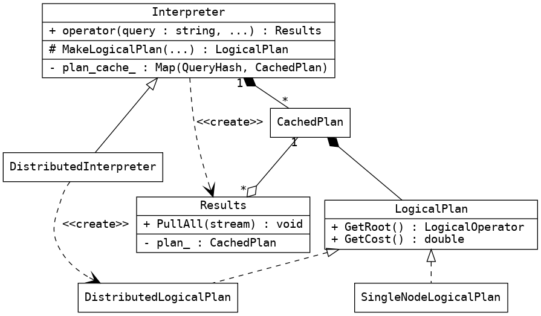

# Query Parsing, Planning and Execution

This part of the documentation deals with query execution.

Memgraph currently supports only query interpretation. Each new query is
parsed, analysed and translated into a sequence of operations which are then
executed on the main database storage. Query execution is organized into the
following phases:

  1.  [Lexical Analysis (Tokenization)](parsing.md)
  2.  [Syntactic Analysis (Parsing)](parsing.md)
  3.  [Semantic Analysis and Symbol Generation](semantic.md)
  4.  [Logical Planning](planning.md)
  5.  [Logical Plan Execution](execution.md)

The main entry point is `Interpreter::operator()`, which takes a query text
string and produces a `Results` object. To instantiate the object,
`Interpreter` needs to perform the above steps from 1 to 4. If any of the
steps fail, a `QueryException` is thrown. The complete `LogicalPlan` is
wrapped into a `CachedPlan` and stored for reuse. This way we can skip the
whole process of analysing a query if it appears to be the same as before.

When we have valid plan, the client code can invoke `Results::PullAll` with a
stream object. The `Results` instance will then execute the plan and fill the
stream with the obtained results.

Since we want to optionally run Memgraph as a distributed database, we have
hooks for creating a different plan of logical operators.
`DistributedInterpreter` inherits from `Interpreter` and overrides
`MakeLogicalPlan` method. This method needs to return a concrete instance of
`LogicalPlan`, and in case of distributed database that will be
`DistributedLogicalPlan`.

